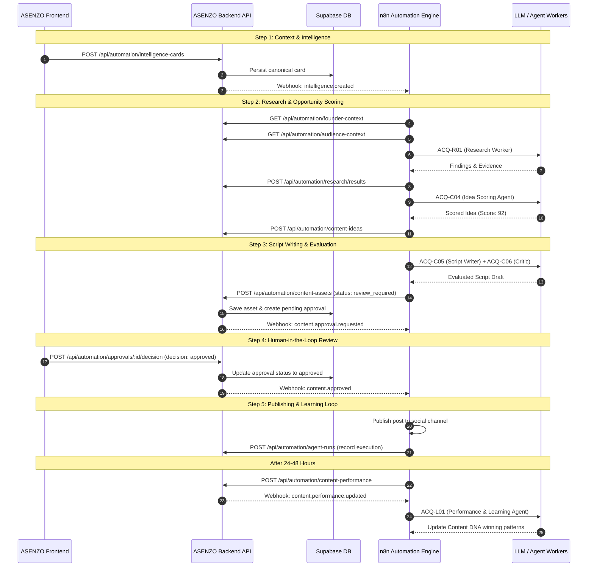

# ASENZO OS — Automation API & Webhook Contract (v1.0.0)

This contract defines the integration specification between the **ASENZO Growth Operating System Backend** (canonical database & business rules) and **n8n** (workflow automation, multi-agent orchestration, and AI model execution).

---

## 1. Architectural Principles

1. **The Backend is the Canonical Source of Truth**: All persistence, authentication, tenant isolation, human approval state, and historical telemetry are owned and validated by the backend.
2. **n8n Owns Workflow & AI Execution**: n8n invokes LLMs, runs scrapers, parses transcripts, and triggers downstream automations. It communicates with the backend **exclusively via HTTP REST APIs**.
3. **No Direct Supabase Table Mutation by n8n**: n8n does not write directly to Supabase tables; it consumes the `/api/automation/...` API surface.
4. **Idempotency by Default**: All mutating `POST` operations support the `Idempotency-Key` header to protect against network retries and duplicate runs.

---

## 2. Authentication & Common Headers

### Request Headers

| Header | Required | Description | Example |
| :--- | :---: | :--- | :--- |
| `x-automation-token` | **Yes** | Internal shared secret for backend-to-n8n authentication. *(Alternatively use `Authorization: Bearer <token>`)* | `asnz_sec_live_9f83a...` |
| `Authorization` | Optional | Standard Bearer token header if `x-automation-token` is not used. | `Bearer asnz_sec_live_9f83a...` |
| `x-workspace-id` | Optional | Target workspace identifier (defaults to primary workspace). | `default-workspace` |
| `Idempotency-Key` | Recommended | Unique execution UUID to prevent duplicate writes on retry. | `a8f1b2c3-4d5e-6f7a-8b9c-0d1e2f3a4b5c` |
| `Content-Type` | **Yes** (POST) | Must be `application/json`. | `application/json` |

---

## 3. Standard Error Format

All error responses follow this unified structure:

```json
{
  "success": false,
  "error": {
    "code": "VALIDATION_FAILED",
    "message": "observation_type must be one of: observed_fact, inferred_psychology, ai_hypothesis, human_verified_insight",
    "details": {}
  }
}
```

### Common Error Codes

- `UNAUTHORIZED` (401): Missing or invalid authentication token.
- `FORBIDDEN` (403): Workspace access denied.
- `RESOURCE_NOT_FOUND` (404): Specified resource ID does not exist.
- `MISSING_REQUIRED_FIELD` (400): A mandatory payload parameter was omitted.
- `VALIDATION_FAILED` (400): Field value does not match schema or allowed enums.
- `IDEMPOTENCY_CONFLICT` (409): Concurrent request with identical key.
- `INTERNAL_SERVER_ERROR` (500): Server error.

---

## 4. Webhook / Event System (Backend → n8n)

When the backend detects a trigger condition (e.g., human approves a script, user inputs context), it dispatches an HTTP POST payload to the configured `N8N_WEBHOOK_URL`.

### Webhook Event Catalog

| Event Name | Triggering Condition | Suggested n8n Action |
| :--- | :--- | :--- |
| `content.context_received` | New business context or positioning update saved | Run Context Intelligence Agent (`ACQ-C01`) |
| `research.requested` | Research job created | Run Research Worker Agent (`ACQ-R01`) |
| `research.completed` | Research findings saved | Run Idea Scoring Agent (`ACQ-C04`) |
| `content.idea.created` | High-scoring idea identified | Run Script Writer Agent (`ACQ-C05`) |
| `content.script.requested` | Script drafting requested | Run Script Writer Agent (`ACQ-C05`) |
| `content.approval.requested` | Draft evaluated and ready for human review | Send notification to Founder / Slack / Email |
| `content.approved` | Founder approves script in UI | Schedule or publish to social channels |
| `content.published` | Post published to social channels | Register post for analytics monitoring |
| `content.performance.updated` | Metric numbers ingested | Run Performance & Learning Agent (`ACQ-L01`) |
| `intelligence.created` | New raw psychological signal saved | Re-evaluate Audience DNA (`ACQ-C02`) |

### Webhook Payload Schema

```json
{
  "event": "content.approval.requested",
  "entity_type": "content_asset",
  "entity_id": "asset_1726139401_x9f8a",
  "workspace_id": "default-workspace",
  "timestamp": "2026-09-12T14:30:00.000Z",
  "requested_action": "review_content",
  "data": {
    "id": "asset_1726139401_x9f8a",
    "topic": "Why Solopreneurs Fail at Delegation",
    "hook": "93% of founders fail at delegation not because of bad hires...",
    "status": "review_required",
    "evaluation": { "score": 92, "hook_power": 9.5 }
  }
}
```

---

## 5. Automation API Endpoints

---

### 5.1 Health Check

#### `GET /api/automation/health`
- **Purpose**: Verify API connectivity, authentication, and database readiness.
- **Headers**: `x-automation-token: <secret>`
- **Response (200 OK)**:
```json
{
  "success": true,
  "status": "healthy",
  "timestamp": "2026-09-12T14:30:00.000Z",
  "version": "1.0.0",
  "system": "ASENZO Founder Growth Operating System",
  "workspace_id": "default-workspace",
  "supabase_connected": true,
  "auth_status": {
    "authenticated": true,
    "token_source": "header_token"
  },
  "supported_modules": [
    "ACQUISITION",
    "CONVERSION",
    "REVENUE",
    "DELIVERY",
    "OPERATIONS"
  ]
}
```

---

### 5.2 Context Endpoints

#### `GET /api/automation/founder-context`
- **Purpose**: Retrieve canonical Founder DNA, voice guidelines, positioning, and phrasing rules for AI generation.
- **Headers**: `x-automation-token: <secret>`
- **Response (200 OK)**:
```json
{
  "success": true,
  "data": {
    "workspace_id": "default-workspace",
    "core_dna": {
      "businessName": "Asenzo OS",
      "businessDescription": "Founder Growth Operating System",
      "positioning": "The systematic operating system for bootstrapped founders."
    },
    "founder_voice": {
      "cadence": "Direct, contrarian, evidence-backed",
      "phrases": ["Systems scale, heroics fail", "Bottleneck-first architecture"],
      "neverSay": ["Synergy", "Rockstar", "Hustle 24/7"]
    },
    "version": 1,
    "status": "active"
  }
}
```

#### `GET /api/automation/audience-context`
- **Purpose**: Retrieve canonical Audience DNA (ICPs, psychological triggers, pain points, natural language phrases).
- **Headers**: `x-automation-token: <secret>`
- **Response (200 OK)**:
```json
{
  "success": true,
  "data": {
    "workspace_id": "default-workspace",
    "icp": {
      "description": "B2B Founders & Solopreneurs doing $10k-$100k MRR",
      "painPoints": ["Stagnant growth", "Founder bottlenecks in sales and content"]
    },
    "buying_triggers": [
      "Stagnant growth despite high effort",
      "Need for systematized pipeline automation"
    ],
    "natural_language_snippets": [
      "I'm spending 20 hours a week writing posts that get zero qualified leads.",
      "Our sales calls feel like starting from scratch every time."
    ],
    "version": 1,
    "status": "active"
  }
}
```

#### `GET /api/automation/content-context`
- **Purpose**: Retrieve canonical Content DNA (winning frameworks, benchmark creators, channels, proven patterns).
- **Headers**: `x-automation-token: <secret>`
- **Response (200 OK)**:
```json
{
  "success": true,
  "data": {
    "workspace_id": "default-workspace",
    "winning_patterns": [
      {
        "name": "Contrarian Problem Breakdown",
        "whyWorked": "Calls out popular industry dogma with tangible counter-evidence."
      }
    ],
    "frameworks": [
      { "name": "Contrarian Breakdown", "structure": "Hook -> Enemy -> Counter-Intuitive Truth -> Proof -> Action" }
    ],
    "version": 1,
    "status": "active"
  }
}
```

---

### 5.3 Intelligence Cards

#### `GET /api/automation/intelligence-cards`
- **Purpose**: Retrieve historical atomic intelligence cards.
- **Query Params**: `?limit=50`
- **Headers**: `x-automation-token: <secret>`
- **Response (200 OK)**:
```json
{
  "success": true,
  "data": [
    {
      "id": "intel_1726139001_8a1b",
      "source_type": "sales_call",
      "category": "objection",
      "signal_type": "price_friction",
      "exact_language": "We don't have budget for another point solution.",
      "observation_type": "observed_fact",
      "confidence": 0.95,
      "human_verified": true
    }
  ],
  "total": 1
}
```

#### `POST /api/automation/intelligence-cards`
- **Purpose**: Ingest an atomic psychological/market observation.
- **Headers**: `x-automation-token: <secret>`, `Idempotency-Key: <uuid>`
- **Request Body**:
```json
{
  "source_type": "sales_call",
  "source_id": "call_rec_1092",
  "source_url": "https://fathom.video/calls/1092",
  "category": "objection",
  "stage": "BOF",
  "signal_type": "price_friction",
  "exact_language": "I love the framework, but I'm worried my team won't adopt it.",
  "context": "Prospect on discovery call discussing team expansion.",
  "emotion": "Apprehension",
  "fear": "Wasted investment and low adoption",
  "desire": "Turnkey onboarding with zero friction",
  "observation_type": "observed_fact",
  "confidence": 0.9,
  "human_verified": false,
  "relevant_modules": ["Acquisition", "Conversion"]
}
```
- **Response (201 Created)**:
```json
{
  "success": true,
  "data": {
    "id": "intel_1726139400_9b2c",
    "workspace_id": "default-workspace",
    "source_type": "sales_call",
    "category": "objection",
    "signal_type": "price_friction",
    "exact_language": "I love the framework, but I'm worried my team won't adopt it.",
    "observation_type": "observed_fact",
    "confidence": 0.9,
    "human_verified": false,
    "created_at": "2026-09-12T14:35:00.000Z"
  }
}
```

---

### 5.4 Research Jobs & Results

#### `GET /api/automation/research/jobs/:id`
- **Purpose**: Get status and details of a research job.
- **Headers**: `x-automation-token: <secret>`
- **Response (200 OK)**:
```json
{
  "success": true,
  "data": {
    "id": "rjob_1726139001_8a1b",
    "objective": "Identify viral LinkedIn hooks on founder bottlenecks",
    "topic": "Founder Bottlenecks",
    "platform": "LinkedIn",
    "status": "queued",
    "priority": "high",
    "assigned_worker": "ACQ-R01"
  }
}
```

#### `POST /api/automation/research/jobs`
- **Purpose**: Create a research job for worker agents.
- **Headers**: `x-automation-token: <secret>`, `Idempotency-Key: <uuid>`
- **Request Body**:
```json
{
  "objective": "Find top performing YouTube breakdowns on bootstrapped SaaS pricing",
  "topic": "SaaS Pricing Strategy",
  "platform": "YouTube",
  "priority": "high",
  "assigned_worker": "ACQ-R01"
}
```
- **Response (201 Created)**:
```json
{
  "success": true,
  "data": {
    "id": "rjob_1726139600_1c2d",
    "workspace_id": "default-workspace",
    "objective": "Find top performing YouTube breakdowns on bootstrapped SaaS pricing",
    "topic": "SaaS Pricing Strategy",
    "status": "queued",
    "priority": "high",
    "created_at": "2026-09-12T14:36:00.000Z"
  }
}
```

#### `POST /api/automation/research/results`
- **Purpose**: Ingest research findings and benchmarked evidence from n8n scrapers/workers.
- **Headers**: `x-automation-token: <secret>`, `Idempotency-Key: <uuid>`
- **Request Body**:
```json
{
  "job_id": "rjob_1726139600_1c2d",
  "topic": "SaaS Pricing Strategy",
  "angle": "Why $29/mo kills bootstrapped software companies",
  "format": "Video Breakdown",
  "platform": "YouTube",
  "creator_source": "Rob Walling",
  "source_url": "https://youtube.com/watch?v=sample123",
  "evidence": { "views": 185000, "multiplier": 4.2 },
  "psychological_trigger": "Pricing inadequacy",
  "score": 88,
  "classification": "proven"
}
```
- **Response (201 Created)**:
```json
{
  "success": true,
  "data": {
    "id": "rres_1726139700_3e4f",
    "topic": "SaaS Pricing Strategy",
    "angle": "Why $29/mo kills bootstrapped software companies",
    "score": 88,
    "classification": "proven",
    "created_at": "2026-09-12T14:37:00.000Z"
  }
}
```

---

### 5.5 Content Ideas & Assets

#### `GET /api/automation/content-ideas/:id`
- **Purpose**: Get a content idea by ID.
- **Headers**: `x-automation-token: <secret>`
- **Response (200 OK)**:
```json
{
  "success": true,
  "data": {
    "id": "idea_1726139001_8a1b",
    "topic": "Delegation vs Abandonment",
    "score": 91,
    "status": "selected"
  }
}
```

#### `POST /api/automation/content-ideas`
- **Purpose**: Ingest an AI-scored content idea.
- **Headers**: `x-automation-token: <secret>`, `Idempotency-Key: <uuid>`
- **Request Body**:
```json
{
  "topic": "Why Founders Fail at Delegation",
  "angle": "Delegation without architecture is just abandonment",
  "audience": "Bootstrapped Founders",
  "platform": "LinkedIn",
  "awareness": "Problem-aware",
  "score": 92,
  "scoring_dimensions": {
    "virality": 8.5,
    "icp_fit": 9.5,
    "novelty": 9.0
  },
  "reasoning": "Directly targets the primary bottleneck of solopreneurs trying to scale."
}
```
- **Response (201 Created)**:
```json
{
  "success": true,
  "data": {
    "id": "idea_1726139800_5g6h",
    "workspace_id": "default-workspace",
    "topic": "Why Founders Fail at Delegation",
    "score": 92,
    "status": "draft",
    "created_at": "2026-09-12T14:38:00.000Z"
  }
}
```

#### `GET /api/automation/content-assets/:id`
- **Purpose**: Get a content asset (script/draft) by ID.
- **Headers**: `x-automation-token: <secret>`
- **Response (200 OK)**:
```json
{
  "success": true,
  "data": {
    "id": "asset_1726139001_8a1b",
    "topic": "Why Founders Fail at Delegation",
    "hook": "Most founders don't delegate. They abandon.",
    "script_body": "Here is the 3-step operating cadence...",
    "status": "review_required",
    "approval_status": "pending"
  }
}
```

#### `POST /api/automation/content-assets`
- **Purpose**: Save a generated script/post draft. If review is required, automatically triggers approval workflow.
- **Headers**: `x-automation-token: <secret>`, `Idempotency-Key: <uuid>`
- **Request Body**:
```json
{
  "idea_id": "idea_1726139800_5g6h",
  "topic": "Why Founders Fail at Delegation",
  "angle": "Delegation without architecture is just abandonment",
  "format": "LinkedIn Post",
  "platform": "LinkedIn",
  "hook": "Most founders don't delegate. They abandon.",
  "script_body": "Most founders don't delegate.\n\nThey dump a messy task on a freelancer and pray.\n\nHere is how to build an SOP that works in 3 steps:\n1. Define the Canonical Artifact\n2. Establish Quality Gates\n3. Assign Autonomous Triggers",
  "cta": "Comment 'OS' and I'll send you our 1-page SOP template.",
  "status": "review_required",
  "approval_status": "pending",
  "evaluation": {
    "critic_score": 94,
    "hook_power": 9.5,
    "retention_score": 9.0
  }
}
```
- **Response (201 Created)**:
```json
{
  "success": true,
  "data": {
    "id": "asset_1726139900_7i8j",
    "workspace_id": "default-workspace",
    "topic": "Why Founders Fail at Delegation",
    "status": "review_required",
    "approval_status": "pending",
    "version": 1,
    "created_at": "2026-09-12T14:39:00.000Z"
  }
}
```

---

### 5.6 Agent Runs & Telemetry

#### `POST /api/automation/agent-runs`
- **Purpose**: Persist execution trace, model telemetry, and outputs from n8n multi-agent nodes.
- **Headers**: `x-automation-token: <secret>`, `Idempotency-Key: <uuid>`
- **Request Body**:
```json
{
  "agent_id": "ACQ-C05",
  "workflow_id": "n8n_wf_script_writer_v1",
  "task": "Generate 3 script variations matching Founder Voice",
  "model": "gemini-1.5-pro",
  "prompt_version": "v2.1",
  "duration_ms": 3200,
  "status": "completed",
  "score": 92,
  "input_payload": { "idea_id": "idea_1726139800_5g6h" },
  "output_payload": { "selected_hook": "Most founders don't delegate. They abandon." }
}
```
- **Response (201 Created)**:
```json
{
  "success": true,
  "data": {
    "id": "run_1726140000_9k0l",
    "agent_id": "ACQ-C05",
    "status": "completed",
    "created_at": "2026-09-12T14:40:00.000Z"
  }
}
```

#### `GET /api/automation/agent-runs/:id`
- **Purpose**: Retrieve historical agent execution details.
- **Headers**: `x-automation-token: <secret>`
- **Response (200 OK)**:
```json
{
  "success": true,
  "data": {
    "id": "run_1726140000_9k0l",
    "agent_id": "ACQ-C05",
    "task": "Generate 3 script variations matching Founder Voice",
    "status": "completed",
    "duration_ms": 3200
  }
}
```

---

### 5.7 Human Approvals & Decisions

#### `POST /api/automation/approvals`
- **Purpose**: Register a human-in-the-loop review item.
- **Headers**: `x-automation-token: <secret>`, `Idempotency-Key: <uuid>`
- **Request Body**:
```json
{
  "entity_type": "content_asset",
  "entity_id": "asset_1726139900_7i8j",
  "action": "publish_to_linkedin",
  "requested_by": "ACQ-C05",
  "proposed_changes": { "channel": "LinkedIn", "scheduled_time": "2026-09-13T09:00:00Z" }
}
```
- **Response (201 Created)**:
```json
{
  "success": true,
  "data": {
    "id": "appr_1726140100_1m2n",
    "entity_type": "content_asset",
    "entity_id": "asset_1726139900_7i8j",
    "action": "publish_to_linkedin",
    "status": "pending",
    "created_at": "2026-09-12T14:41:00.000Z"
  }
}
```

#### `GET /api/automation/approvals/:id`
- **Purpose**: Check the state of an approval request.
- **Headers**: `x-automation-token: <secret>`
- **Response (200 OK)**:
```json
{
  "success": true,
  "data": {
    "id": "appr_1726140100_1m2n",
    "status": "approved",
    "reviewer_id": "founder_mark",
    "resolved_at": "2026-09-12T14:45:00.000Z"
  }
}
```

#### `POST /api/automation/approvals/:id/decision`
- **Purpose**: Submit a human decision (`approved`, `rejected`, `edited`, `cancelled`). If approved, triggers `content.approved` webhook to resume n8n execution.
- **Headers**: `x-automation-token: <secret>`, `Idempotency-Key: <uuid>`
- **Request Body**:
```json
{
  "decision": "approved",
  "reviewer_id": "founder_mark",
  "feedback": "Great hook, approved for publishing tomorrow morning."
}
```
- **Response (200 OK)**:
```json
{
  "success": true,
  "data": {
    "id": "appr_1726140100_1m2n",
    "status": "approved",
    "reviewer_id": "founder_mark",
    "feedback": "Great hook, approved for publishing tomorrow morning.",
    "resolved_at": "2026-09-12T14:45:00.000Z"
  }
}
```

---

### 5.8 Content Performance & Feedback

#### `GET /api/automation/content-performance`
- **Purpose**: Fetch historical post performance and attribution metrics.
- **Query Params**: `?limit=50`
- **Headers**: `x-automation-token: <secret>`
- **Response (200 OK)**:
```json
{
  "success": true,
  "data": [
    {
      "id": "perf_1726140200_3o4p",
      "content_id": "asset_1726139900_7i8j",
      "platform": "LinkedIn",
      "views": 24500,
      "engagements": 680,
      "leads": 18,
      "revenue_influenced": 4500
    }
  ],
  "total": 1
}
```

#### `POST /api/automation/content-performance`
- **Purpose**: Ingest social media performance metrics to fuel the Learning Loop (`ACQ-L01`).
- **Headers**: `x-automation-token: <secret>`, `Idempotency-Key: <uuid>`
- **Request Body**:
```json
{
  "content_id": "asset_1726139900_7i8j",
  "platform": "LinkedIn",
  "published_at": "2026-09-13T09:00:00Z",
  "views": 24500,
  "reach": 18900,
  "engagements": 680,
  "comments": 142,
  "shares": 38,
  "saves": 94,
  "clicks": 310,
  "ctr": 1.26,
  "leads": 18,
  "conversions": 2,
  "revenue_influenced": 4500,
  "source_provenance": "LinkedIn Analytics Export / API"
}
```
- **Response (201 Created)**:
```json
{
  "success": true,
  "data": {
    "id": "perf_1726140200_3o4p",
    "content_id": "asset_1726139900_7i8j",
    "platform": "LinkedIn",
    "views": 24500,
    "leads": 18,
    "created_at": "2026-09-12T14:48:00.000Z"
  }
}
```

---

## 6. End-to-End Acquisition Pipeline Walkthrough



---

## 7. First Endpoint for the n8n Engineer to Test

Start with the health check endpoint:

```bash
curl -X GET "http://localhost:3000/api/automation/health" \
  -H "x-automation-token: asenzo-dev-token" \
  -H "x-workspace-id: default-workspace"
```
